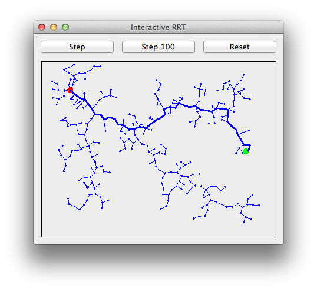

# RRT

C++ RRT (Rapidly-exploring Random Tree) implementation

Here's a gif of an RRT from wikipedia:

Interactive RRT Viewer
----------------------

This project contains an interactive RRT viewer.  The source and destination points can be dragged with a mouse.  Here's a screenshot:

Building
--------

Run `./build.sh` in the main directory to build the `rrt-viewer` program and the `test-runner` program, which are placed in the `build/` folder.

## Resources

Here are some good resources for learning more about RRTs:

* http://msl.cs.uiuc.edu/rrt/
* [Wikipedia](http://en.wikipedia.org/wiki/Rapidly_exploring_random_tree)
