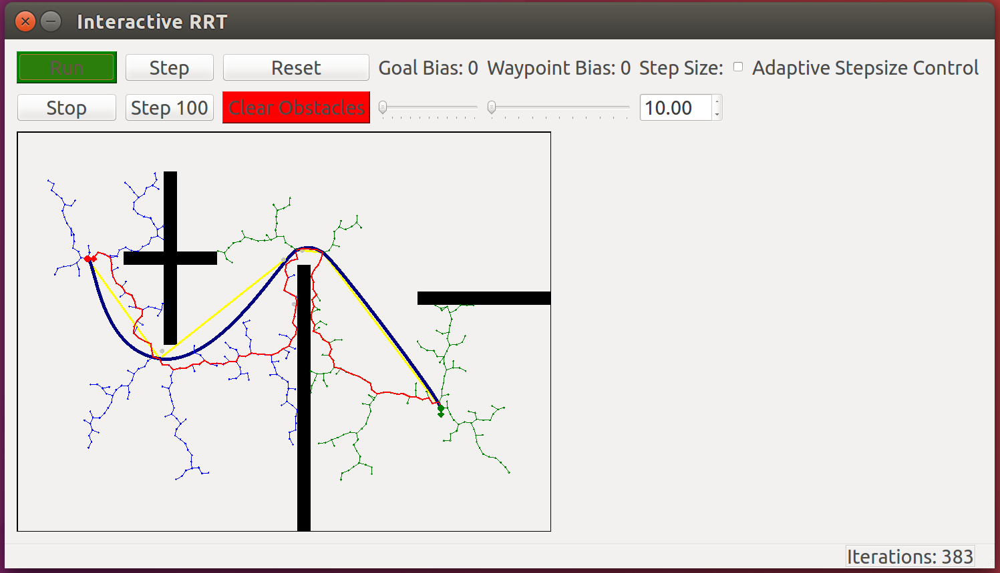

# RRT 

C++ RRT (Rapidly-exploring Random Tree) implementation

## Interactive RRT Viewer

This project contains an interactive RRT viewer.  The source and destination points can be dragged with a mouse.  Here's a screenshot:

## Dependencies

The following are required in order to build this project:

* cmake >= 2.8.9
* Qt 5 (`qt5` on Ubuntu)
* Eigen (`libeigen3-dev` on Ubuntu)

## Building

Run `make` in the main directory to build the `rrt-viewer` program and the `test-runner` program, which are placed in the `build/` folder.

## Resources

Here are some good resources for learning more about RRTs:

* http://msl.cs.uiuc.edu/rrt/
* [Wikipedia](http://en.wikipedia.org/wiki/Rapidly_exploring_random_tree)
* http://www.cs.cmu.edu/~15780/readings/02iros-errt.pdf
